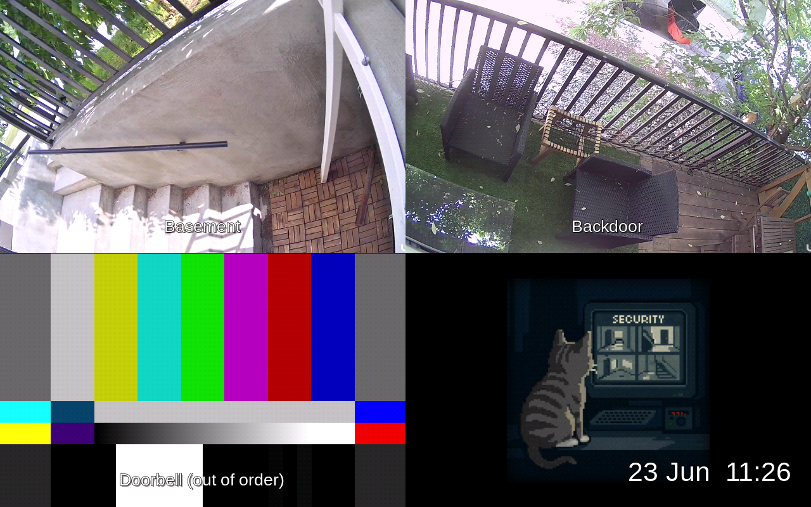
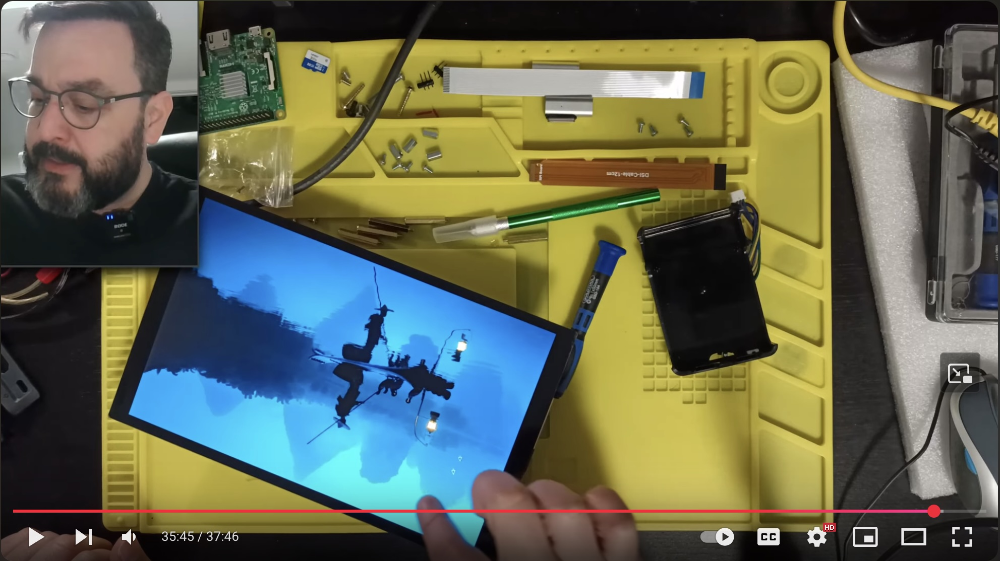
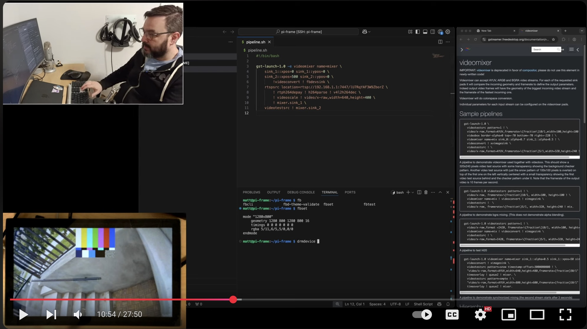

# pi-frame
Raspberry Pi viewer for Unifi Cameras

A Rust-based application that displays multiple video streams (RTSP, images, or test patterns) on a Raspberry Pi framebuffer in a grid layout. Perfect for creating a multi-camera monitoring display using a Raspberry Pi with a display.



## Videos

I've got a few videos on the project available on my YouTube channel [@Paleotechnica](https://www.youtube.com/@Paleotechnica):

[Setting up the display](https://www.youtube.com/watch?v=QM3KeK8U2nE):

<a href="https://www.youtube.com/watch?v=QM3KeK8U2nE"></a>

[Writing the software](https://www.youtube.com/watch?v=UDPTQ9VW_7c):

<a href="https://www.youtube.com/watch?v=UDPTQ9VW_7c"></a>

## Installation

### Prerequisites

- Raspberry Pi (tested on Pi 4)
- Display connected to the Pi (tested w/Waveshare 10.1" 1280x800)
- Rust toolchain (for building from source)

### 1. Build the Application

```bash
# Clone the repository
git clone https://github.com/mmastrac/pi-frame
cd pi-frame

# Build the application
cargo build --release
```

### 2. Install System Files

```bash
# Copy the binary to the service directory
sudo cp target/release/pi-frame /srv/pi-frame/

# Copy configuration and service files
sudo cp srv/pi-frame/* /srv/pi-frame/

# Make the binary executable
sudo chmod +x /srv/pi-frame/pi-frame
```

### 3. Configure the Display

The application uses a TOML configuration file. Copy the example configuration:

```bash
sudo cp srv/pi-frame/config.toml /srv/pi-frame/
```

Edit `/srv/pi-frame/config.toml` to match your setup:

```toml
[display]
framebuffer="/dev/fb0"
layout = { horizontal = 2, vertical = 2 }  # 2x2 grid
time="%d %b  %H:%M"  # Optional time display

[[sources]]
description="Camera 1"
rtsp="rtsp://your-camera-ip:port/stream"

[[sources]]
description="Camera 2"
rtsp="rtsp://your-camera-ip:port/stream"

[[sources]]
description="Test Pattern"
videotestsrc="smpte-rp-219"

[[sources]]
description="Static Image"
image="path/to/image.png"
width=640
height=640
```

### 4. Configure Boot Settings (Optional)

For headless operation or specific display configurations, you may need to modify boot settings:

```bash
# Copy boot configuration files
sudo cp boot/firmware/cmdline.txt /boot/firmware/
sudo cp boot/firmware/config.txt /boot/firmware/

# Copy initramfs modules over top of the existing ones
sudo cp -r etc/initramfs-tools/* /etc/initramfs-tools/
sudo update-initramfs -u
```

### 5. Enable and Start the Service

```bash
# Copy the systemd service file
sudo cp srv/pi-frame/pi-frame.service /etc/systemd/system/

# Reload systemd and enable the service
sudo systemctl isolate multi-user.target
sudo systemctl set-default multi-user.target
sudo systemctl daemon-reload
sudo systemctl enable pi-frame.service
sudo systemctl start pi-frame.service
```

### 6. Verify Installation

Check the service status:

```bash
sudo systemctl status pi-frame.service
```

View logs:

```bash
sudo journalctl -u pi-frame.service -f
```

## Configuration

### Source Types

**RTSP Stream:**
```toml
[[sources]]
description="Camera Name"
rtsp="rtsp://ip:port/stream"
```

**Test Pattern:**
```toml
[[sources]]
description="Test Pattern"
videotestsrc="smpte-rp-219"
```

**Static Image:**
```toml
[[sources]]
description="Image"
image="path/to/image.png"
width=640  # optional
height=640 # optional
```

### Display Options

- `framebuffer`: Path to framebuffer device (usually `/dev/fb0`)
- `layout`: Grid layout with `horizontal` and `vertical` counts
- `time`: Optional time format string for clock overlay

## Development

### Building

```bash
cargo build
cargo run -- config.toml
```

## License

GPLv3

